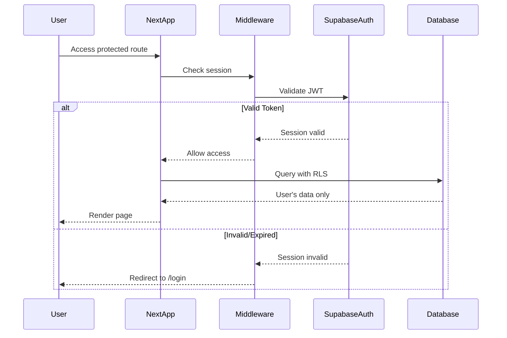

# Backend Architecture

## Service Architecture (Serverless with Next.js API Routes)

### Function Organization

```
apps/web/src/app/api/
├── images/
│   └── upload/
│       └── route.ts            # Image upload and compression
├── analytics/
│   ├── dashboard/
│   │   └── route.ts            # Dashboard aggregations
│   ├── trends/
│   │   └── route.ts            # Trend calculations
│   └── categories/
│       └── route.ts            # Category breakdown
└── webhooks/
    └── supabase/
        └── route.ts            # Supabase webhooks (if needed)
```

### API Route Template

```typescript
// apps/web/src/app/api/images/upload/route.ts
import { NextRequest, NextResponse } from 'next/server';
import { createRouteHandlerClient } from '@supabase/auth-helpers-nextjs';
import { cookies } from 'next/headers';
import sharp from 'sharp';

export async function POST(request: NextRequest) {
  try {
    // Auth check
    const supabase = createRouteHandlerClient({ cookies });
    const {
      data: { session },
    } = await supabase.auth.getSession();

    if (!session) {
      return NextResponse.json(
        { error: { code: 'UNAUTHORIZED', message: 'Not authenticated' } },
        { status: 401 }
      );
    }

    // Get uploaded file
    const formData = await request.formData();
    const file = formData.get('file') as File;

    if (!file) {
      return NextResponse.json(
        { error: { code: 'NO_FILE', message: 'No file provided' } },
        { status: 400 }
      );
    }

    // Compress image
    const buffer = Buffer.from(await file.arrayBuffer());
    const compressed = await sharp(buffer)
      .resize(1920, 1920, { fit: 'inside', withoutEnlargement: true })
      .jpeg({ quality: 85 })
      .toBuffer();

    // Upload to Supabase Storage
    const fileName = `${session.user.id}/${Date.now()}-${file.name}`;
    const { data, error } = await supabase.storage
      .from('receipts')
      .upload(fileName, compressed, {
        contentType: 'image/jpeg',
        upsert: false,
      });

    if (error) throw error;

    // Get public URL
    const {
      data: { publicUrl },
    } = supabase.storage.from('receipts').getPublicUrl(fileName);

    return NextResponse.json({
      data: {
        url: publicUrl,
        path: data.path,
      },
    });
  } catch (error) {
    console.error('Upload error:', error);
    return NextResponse.json(
      {
        error: {
          code: 'UPLOAD_FAILED',
          message: 'Failed to upload image',
          details: error instanceof Error ? error.message : 'Unknown error',
        },
      },
      { status: 500 }
    );
  }
}
```

## Authentication and Authorization

### Auth Flow



### Middleware/Guards

```typescript
// apps/web/src/middleware.ts
import { createMiddlewareClient } from '@supabase/auth-helpers-nextjs';
import { NextResponse } from 'next/server';
import type { NextRequest } from 'next/server';

export async function middleware(req: NextRequest) {
  const res = NextResponse.next();
  const supabase = createMiddlewareClient({ req, res });

  const {
    data: { session },
  } = await supabase.auth.getSession();

  // Protected routes
  if (req.nextUrl.pathname.startsWith('/dashboard') ||
      req.nextUrl.pathname.startsWith('/receipts') ||
      req.nextUrl.pathname.startsWith('/categories') ||
      req.nextUrl.pathname.startsWith('/profile')) {
    if (!session) {
      return NextResponse.redirect(new URL('/login', req.url));
    }
  }

  // Auth routes (redirect if already logged in)
  if (req.nextUrl.pathname.startsWith('/login') ||
      req.nextUrl.pathname.startsWith('/register')) {
    if (session) {
      return NextResponse.redirect(new URL('/dashboard', req.url));
    }
  }

  return res;
}

export const config = {
  matcher: [
    '/dashboard/:path*',
    '/receipts/:path*',
    '/categories/:path*',
    '/profile/:path*',
    '/login',
    '/register',
  ],
};
```

---
