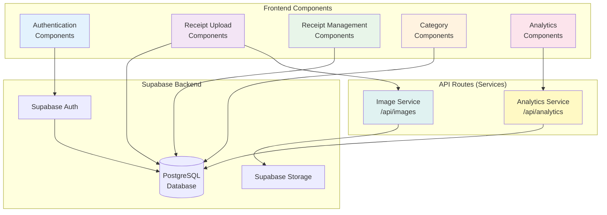

# Components

## Frontend Components

### Authentication Components

**Responsibility:** Handle user registration, login, password recovery, and profile management.

**Key Interfaces:**
- `LoginForm` - Email/password login with validation
- `RegisterForm` - User registration with email confirmation
- `PasswordResetForm` - Request and confirm password reset
- `ProfileForm` - View and edit user profile

**Dependencies:** Supabase Auth client, React Hook Form, Zod validation

**Technology Stack:** React Server Components for initial render, Client Components for interactivity

---

### Receipt Upload Components

**Responsibility:** Handle receipt photo upload, metadata entry, and image preview.

**Key Interfaces:**
- `ReceiptUploadForm` - File input with drag-and-drop
- `ImagePreview` - Display uploaded image before save
- `MetadataForm` - Store name, date, amount, notes input
- `UploadProgress` - Progress indicator during upload

**Dependencies:** Next.js Image, Supabase Storage client, React Hook Form

**Technology Stack:** Client Components (requires file API and interactivity)

---

### Receipt Management Components

**Responsibility:** Display, filter, search, and manage receipt list and details.

**Key Interfaces:**
- `ReceiptList` - Paginated list with thumbnails
- `ReceiptCard` - Individual receipt display
- `ReceiptDetail` - Full receipt view with edit/delete
- `ReceiptFilters` - Date range, store, category filters
- `ReceiptSearch` - Search by store name

**Dependencies:** Supabase client, Tanstack Query for data fetching

**Technology Stack:** Mix of Server Components (list) and Client Components (filters)

---

### Category Components

**Responsibility:** Category CRUD operations and assignment to receipts.

**Key Interfaces:**
- `CategoryList` - Display all categories with receipt counts
- `CategoryForm` - Create/edit category with color picker
- `CategoryPicker` - Multi-select for receipt categorization
- `CategoryBadge` - Display category with color

**Dependencies:** Supabase client, React Hook Form

**Technology Stack:** Server Components for list, Client Components for forms

---

### Analytics Components

**Responsibility:** Display spending analytics, charts, and insights.

**Key Interfaces:**
- `Dashboard` - Main analytics view with cards
- `SpendingOverview` - Total/average/comparison cards
- `CategoryBreakdownChart` - Pie chart with Recharts
- `TrendChart` - Line chart for spending over time
- `StoreAnalysis` - Table/chart of spending by store
- `QuickStats` - Most frequent category, highest purchase, etc.

**Dependencies:** Recharts, Supabase client, date-fns

**Technology Stack:** Server Components for data fetching, Client Components for charts

---

## Backend Services (API Routes)

### Image Service

**Responsibility:** Handle image upload to Supabase Storage. Image compression happens CLIENT-SIDE to avoid serverless timeout issues.

**Key Interfaces:**
- `POST /api/images/upload` - Upload pre-compressed image from client

**Dependencies:** Supabase Storage client

**Technology Stack:** Next.js API Routes (Serverless Functions, not Edge due to Storage SDK)

**MVP Simplification:** 
- Client compresses images using `browser-image-compression` library before upload
- No server-side Sharp processing (avoids serverless timeouts and cold starts)
- Direct uploads to Supabase Storage when possible

---

### Analytics Service

**Responsibility:** Aggregate and calculate analytics data.

**Key Interfaces:**
- `GET /api/analytics/dashboard` - Dashboard aggregations only

**Dependencies:** Supabase client, SQL aggregation functions

**Technology Stack:** Next.js API Routes with Supabase queries

**MVP Simplification:**
- Single dashboard endpoint for all analytics
- Simple SQL aggregations, no complex calculations
- Trends calculated in components using client-side logic if needed

---

## Component Diagram

---
