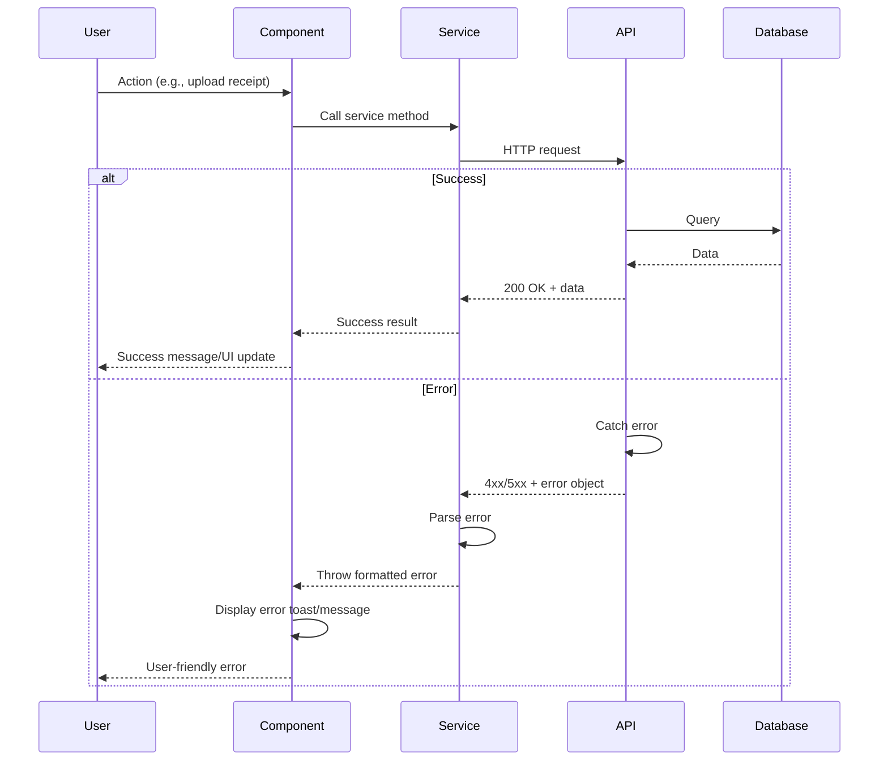

# Error Handling Strategy

## Error Flow



## Error Response Format

```typescript
// packages/shared/src/types/api.ts
export interface ApiError {
  error: {
    code: string;          // Machine-readable error code
    message: string;       // Human-readable message
    details?: Record<string, any>;  // Additional context
    timestamp?: string;    // ISO 8601 timestamp
    requestId?: string;    // For debugging/support
  };
}

// Example errors
const errors = {
  UNAUTHORIZED: {
    code: 'UNAUTHORIZED',
    message: 'You must be logged in to perform this action',
  },
  VALIDATION_ERROR: {
    code: 'VALIDATION_ERROR',
    message: 'Invalid input data',
    details: { field: 'email', reason: 'Invalid format' },
  },
  NOT_FOUND: {
    code: 'NOT_FOUND',
    message: 'Resource not found',
  },
  RATE_LIMIT_EXCEEDED: {
    code: 'RATE_LIMIT_EXCEEDED',
    message: 'Too many requests. Please try again later',
  },
};
```

## Frontend Error Handling

```typescript
// apps/web/src/lib/errors.ts
export class ApiError extends Error {
  constructor(
    public code: string,
    public message: string,
    public details?: Record<string, any>
  ) {
    super(message);
    this.name = 'ApiError';
  }

  static fromResponse(error: ApiError['error']): ApiError {
    return new ApiError(error.code, error.message, error.details);
  }
}

// Usage in service
try {
  const response = await fetch('/api/receipts', {
    method: 'POST',
    body: JSON.stringify(data),
  });

  if (!response.ok) {
    const error = await response.json();
    throw ApiError.fromResponse(error.error);
  }

  return await response.json();
} catch (error) {
  if (error instanceof ApiError) {
    // Handle known API errors
    toast.error(error.message);
  } else {
    // Handle unknown errors
    toast.error('Something went wrong. Please try again.');
  }
  throw error;
}
```

## Backend Error Handling

```typescript
// apps/web/src/lib/api-handler.ts
import { NextResponse } from 'next/server';

export function errorResponse(
  code: string,
  message: string,
  status: number,
  details?: Record<string, any>
) {
  return NextResponse.json(
    {
      error: {
        code,
        message,
        details,
        timestamp: new Date().toISOString(),
      },
    },
    { status }
  );
}

// Usage in API route
try {
  // ... business logic
} catch (error) {
  if (error instanceof ZodError) {
    return errorResponse(
      'VALIDATION_ERROR',
      'Invalid input data',
      400,
      { errors: error.errors }
    );
  }

  if (error instanceof PostgrestError) {
    return errorResponse(
      'DATABASE_ERROR',
      'Database operation failed',
      500
    );
  }

  return errorResponse(
    'INTERNAL_ERROR',
    'An unexpected error occurred',
    500
  );
}
```

---
