# High Level Architecture

## Technical Summary

Daticket is a modern Jamstack application built with Next.js 14 (App Router) for the frontend and Supabase as the Backend-as-a-Service (BaaS). The architecture follows a serverless approach with API routes hosted on Vercel Edge Functions, a PostgreSQL database managed by Supabase, and Supabase Storage for receipt images. 

The frontend leverages React Server Components for optimal performance, with client-side state management for interactive features. Authentication is handled entirely by Supabase Auth with Row Level Security (RLS) enforcing data isolation at the database level. The system is deployed as a static site with server-side rendering capabilities on Vercel, with Supabase providing the backend infrastructure.

This architecture achieves the PRD goals of rapid development (6-week MVP), responsive design across all devices, secure multi-tenant data isolation, and scalable image storage.

## Platform and Infrastructure Choice

**Platform:** Vercel + Supabase Cloud

**Key Services:**
- **Hosting:** Vercel (Next.js hosting with Edge Functions)
- **Database:** Supabase PostgreSQL (managed)
- **Authentication:** Supabase Auth (email/password, JWT)
- **Storage:** Supabase Storage (S3-compatible)
- **API:** Next.js API Routes + Supabase Client
- **CDN:** Vercel Edge Network (global)

**Deployment Regions:**
- **Frontend:** Vercel Edge (Global CDN, ~100+ edge locations)
- **Database:** Supabase US East (primary), with option to change region
- **Storage:** Supabase US East (co-located with database)

**Rationale:**
- **Rapid Development:** Vercel + Supabase is optimized for Next.js with zero infrastructure management
- **Cost-Effective:** Both platforms offer generous free tiers suitable for hobby projects
- **Integrated Auth:** Supabase Auth integrates seamlessly with Next.js middleware
- **Global Performance:** Vercel Edge ensures fast load times worldwide
- **Hobby Project Friendly:** No DevOps overhead, focus purely on features

## Repository Structure

**Structure:** Single Repository (Simplified for MVP)

**Package Manager:** pnpm

**Project Organization:**
```
daticket/
├── src/
│   ├── app/                 # Next.js App Router
│   ├── components/          # React components
│   ├── lib/
│   │   ├── types/           # Shared TypeScript types (instead of separate package)
│   │   ├── api/             # API clients and services
│   │   └── utils/           # Utility functions
│   └── middleware.ts        # Next.js middleware
├── supabase/
│   ├── migrations/          # Database migrations
│   └── seed.sql             # Initial data
├── public/                  # Static assets
└── package.json
```

**Rationale:** 
- **MVP Simplicity:** No monorepo complexity for initial development
- **Faster Setup:** Start coding immediately, no workspace configuration
- **Lower Learning Curve:** Standard Next.js project structure
- **Future Migration Path:** Can refactor to monorepo later if project grows
- **Pre-Mortem Learning:** Avoid "Monorepo Configuration Hell" failure scenario

## High Level Architecture Diagram

```mermaid
graph TB
    subgraph "User Access"
        User[👤 User<br/>Web Browser]
    end

    subgraph "Vercel Platform"
        CDN[🌐 Vercel Edge CDN<br/>Static Assets]
        NextApp[⚡ Next.js App<br/>App Router + RSC]
        API[🔌 API Routes<br/>Edge Functions]
    end

    subgraph "Supabase Platform"
        Auth[🔐 Supabase Auth<br/>JWT Tokens]
        DB[(🗄️ PostgreSQL<br/>+ RLS)]
        Storage[📦 Supabase Storage<br/>Receipt Images]
    end

    User -->|HTTPS| CDN
    CDN --> NextApp
    NextApp --> API
    API --> Auth
    API --> DB
    API --> Storage
    
    Auth --> DB
    Storage --> DB

    style User fill:#e1f5ff
    style CDN fill:#fff4e6
    style NextApp fill:#e8f5e9
    style API fill:#f3e5f5
    style Auth fill:#ffebee
    style DB fill:#fff3e0
    style Storage fill:#e0f2f1
```



## Architectural Patterns

- **Jamstack Architecture:** Static site generation with serverless API routes - _Rationale:_ Optimal performance and security for content-heavy applications with dynamic data needs

- **Component-Based UI:** Reusable React Server Components and Client Components - _Rationale:_ Maintainability and performance through React Server Components, with client components only where interactivity is needed

- **BaaS Pattern:** Backend-as-a-Service with Supabase - _Rationale:_ Eliminates backend infrastructure management, provides built-in auth, database, and storage

- **Row Level Security (RLS):** Database-level security policies - _Rationale:_ Data isolation enforced at the database, preventing unauthorized access even if API is compromised

- **API Route Pattern:** Next.js API routes as backend endpoints - _Rationale:_ Co-located with frontend code, deployed as serverless functions, type-safe with TypeScript

- **Repository Pattern:** Abstract data access through service layer - _Rationale:_ Separates business logic from data access, enables testing and maintains clean architecture

---
